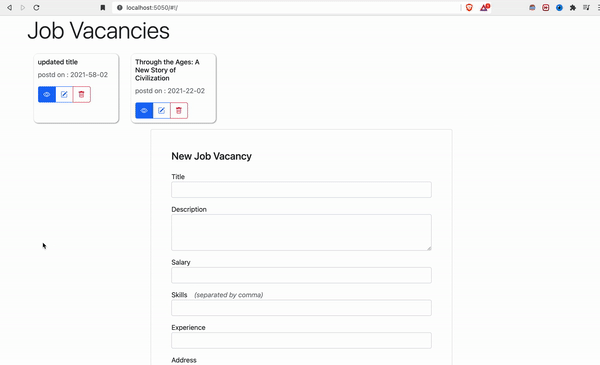
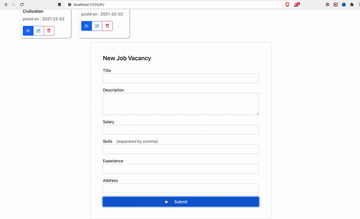

### Day-10 assignment 

#### Job searching MEAN application

##### Backend 

* setup project using `npm init` and install `mongoos`, `express` 
* create the model and controller of job
* attach controller with route
* setup angular frontend
* create http factory for job data
* create 2 controllers for job listing page and job detail page
* setup a route for the frontend 
* use date and currency filters

#### Endpoints

* `[GET]` `/api/jobs?limit=10&offset=1`
* `[POST]` `/api/jobs`
* `[GET]` `/api/jobs/:jobId`
* `[PUT]` `/api/jobs/:jobId`
* `[DELETE]` `/api/jobs/:jobId`

#### Frontend Demo

##### Delete and Create

##### Update and view detail

